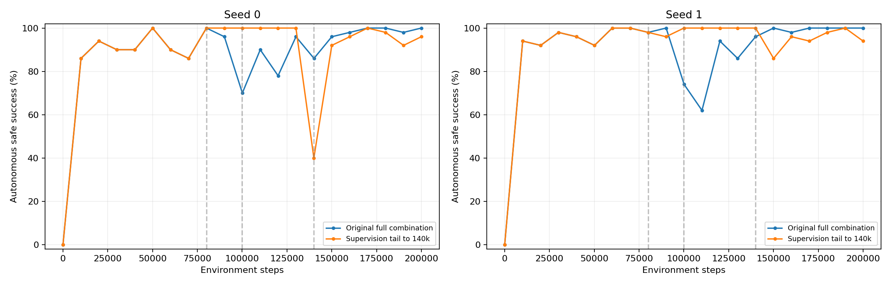

# 动作监督尾段延期：已完成seed的阶段性对比

范围：seed 0, 1。仅为已完成seed的描述性结果，不能代替五seed结论。

本报告审查两个方法的全部21次原50场景自主验证（epsilon=0，无A*代选），以及每次失败的实际轨迹；没有使用新的独立500场景表现，也没有启动、停止或修改训练。所有最终结果来自200000步模型，不选择最佳检查点。

## 逐seed结果

| seed | 方法 | 全程AULC | 原退出窗最低 | 新退出窗最低 | 14–20万步AULC | 最后五次均值 | 最终成功 | 最终碰撞 | 最终超时 |
|---|---|---:|---:|---:|---:|---:|---:|---:|---:|
| 0 | 原完整组合 | 89.69% | 70.00% | 86.00% | 97.49% | 99.20% | 100.00% | 0.00% | 0.00% |
| 0 | 监督尾段延期 | 90.08% | 100.00% | 40.00% | 90.99% | 96.40% | 96.00% | 2.00% | 2.00% |
| 1 | 原完整组合 | 91.50% | 62.00% | 86.00% | 99.33% | 99.60% | 100.00% | 0.00% | 0.00% |
| 1 | 监督尾段延期 | 94.34% | 96.00% | 86.00% | 95.17% | 96.40% | 94.00% | 6.00% | 0.00% |

## 均值±样本标准差

| 方法 | 全程AULC | 原退出窗最低 | 新退出窗最低 | 14–20万步AULC | 最后五次均值 | 最终成功 | 最终碰撞 | 最终超时 |
|---|---:|---:|---:|---:|---:|---:|---:|---:|
| 原完整组合 | 90.59±1.28% | 66.00±5.66% | 86.00±0.00% | 98.41±1.30% | 99.40±0.28% | 100.00±0.00% | 0.00±0.00% | 0.00±0.00% |
| 监督尾段延期 | 92.21±3.01% | 98.00±2.83% | 63.00±32.53% | 93.08±2.96% | 96.40±0.00% | 95.00±1.41% | 4.00±2.83% | 1.00±1.41% |

## 最低点和实际失败类型

- seed0：合并退出窗最低点140015步，成功率40%；碰撞0，等待超时30，循环超时0，其他超时0。失败结束位置计数：{(7, 5): 23, (30, 12): 6, (19, 10): 1}。
- seed1：合并退出窗最低点150057步，成功率86%；碰撞2，等待超时0，循环超时5，其他超时0。失败结束位置计数：{(7, 11): 3, (23, 33): 1, (23, 17): 1, (25, 17): 1, (9, 7): 1}。

## 各窗口失败次数

| seed | 方法 | 范围 | 碰撞 | 等待超时 | 循环超时 | 其他超时 |
|---|---|---|---:|---:|---:|---:|
| 0 | 原完整组合 | 原退出窗 | 2 | 15 | 16 | 0 |
| 0 | 原完整组合 | 新退出窗 | 4 | 0 | 8 | 0 |
| 0 | 原完整组合 | 14–20万步 | 4 | 0 | 7 | 0 |
| 0 | 原完整组合 | 最终50场景 | 0 | 0 | 0 | 0 |
| 0 | 监督尾段延期 | 原退出窗 | 0 | 0 | 0 | 0 |
| 0 | 监督尾段延期 | 新退出窗 | 5 | 30 | 1 | 0 |
| 0 | 监督尾段延期 | 14–20万步 | 7 | 34 | 2 | 0 |
| 0 | 监督尾段延期 | 最终50场景 | 1 | 0 | 1 | 0 |
| 1 | 原完整组合 | 原退出窗 | 0 | 14 | 21 | 0 |
| 1 | 原完整组合 | 新退出窗 | 2 | 6 | 2 | 0 |
| 1 | 原完整组合 | 14–20万步 | 1 | 0 | 2 | 0 |
| 1 | 原完整组合 | 最终50场景 | 0 | 0 | 0 | 0 |
| 1 | 监督尾段延期 | 原退出窗 | 0 | 0 | 2 | 0 |
| 1 | 监督尾段延期 | 新退出窗 | 4 | 0 | 5 | 0 |
| 1 | 监督尾段延期 | 14–20万步 | 11 | 0 | 5 | 0 |
| 1 | 监督尾段延期 | 最终50场景 | 3 | 0 | 0 | 0 |

## 核查与解释范围

- 核查了84个检查点、4200条逐场景记录和446条原始失败轨迹。
- 每个seed与原组合的完整初始状态一致；前8万步内结束的训练回合所有记录列逐条一致：seed0 819条，seed1 835条。
- 源码、配置和最终模型指纹通过原注册核查；199501次实际更新的监督权重日志与新旧日程一致。A*代选仍于10万步退出，监督于14万步归零。
- 原退出窗口90000–120500，新退出窗口130000–160500；AULC依据实际检查点步数线性插值。所有分阶段AULC、合并窗口最低点、配对差值及其样本标准差见CSV。
- 窗口失败次数是该窗口各检查点的累计次数，同一场景可能重复失败，不能解释为独立场景总数。
- 等待超时：WAIT比例至少50%；循环超时：非等待主导且反复移动占比至少50%（至少20次移动），或尾部60位置出现2–12周期；其余归其他超时。
- 静态可达不等于动态条件下300步内一定可达；失败原因依据动作轨迹分类，不能单凭成功率猜测。
- 监督总权重积分增加8%，本实验不能单独区分退出时间和累计监督量的影响；低谷发生在退出附近也不足以证明唯一因果机制。
- 目前两个seed均显示原退出窗改善、后期AULC下降：seed0低谷后移且更深，seed1低谷后移但幅度减轻。继续完成原定其余seed后，统一分析并使用冻结的新500场景评估最终模型；期间不根据本阶段结果修改设置。

